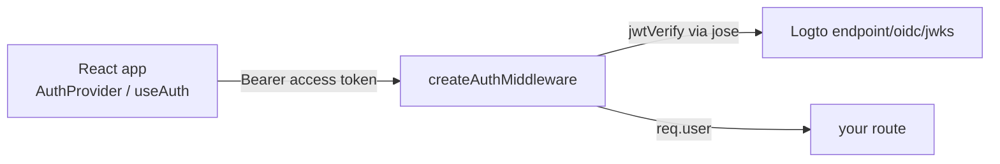

# @mrsarac/auth

A small TypeScript package for Logto-based auth: JWT verification against Logto's JWKS, Express middleware, React hooks and a guest mode.

[](package.json)

## Why

It collects the Logto setup that small apps tend to repeat: verify access tokens on an Express API, read the signed-in user in React, and let visitors try a few actions as a guest before signing in.

## Quick start

The package is not on the npm registry. The built `dist/` folder is committed, so you can install it straight from GitHub:

```bash
npm install github:neurabytelabs/auth
```

It installs under the name `@mrsarac/auth`. `@logto/react` (>= 3) and `react` (>= 18) are optional peer dependencies, needed only for the React exports.

### Backend (Express)

```typescript
import { createAuthMiddleware } from '@mrsarac/auth/middleware';

const auth = createAuthMiddleware({
  endpoint: 'https://your-tenant.logto.app', // your Logto endpoint, without /oidc
  audience: 'your-api-resource',             // a string, or an array to accept several audiences
});

app.use('/api/protected', auth);
// handlers then read req.user (id, email, name, picture) and req.tokenPayload
```

`createAuthMiddleware` also takes an optional `getDbUserId(logtoId)` callback that sets `req.user.dbUserId`.

### Frontend (React)

```tsx
import { LogtoProvider } from '@logto/react';
import { AuthProvider, useAuth } from '@mrsarac/auth/react';

function App() {
  return (
    <LogtoProvider config={logtoConfig}>
      <AuthProvider apiResource="https://api.example.com">
        <MyApp />
      </AuthProvider>
    </LogtoProvider>
  );
}

function MyComponent() {
  const { isAuthenticated, user, login, logout, getAccessToken } = useAuth();
  // ...
}
```

### Development

```bash
npm ci
npm run build       # tsup -> dist/ (CJS + ESM + type declarations)
npm run test:run    # vitest
npm run typecheck   # tsc --noEmit
```

## How it works



Exports by entry point:

| Entry | Exports |
|---|---|
| `@mrsarac/auth` | `verifyToken`, `verifyTokenMultiAudience`, `createJWKS`, `createLogtoConfig`, `syncUser`, `getUserByLogtoId`, `authLogger`, the middleware below, constants and types |
| `@mrsarac/auth/middleware` | `createAuthMiddleware`, `authMiddleware`, `optionalAuthMiddleware`, `createGuestMiddleware`, `getGuestSession`, `isGuestMode` |
| `@mrsarac/auth/react` | `AuthProvider`, `useAuth`, `AuthContext`, `GuestModeProvider`, `useGuestMode` |

- **Token verification** uses `jose` with a remote JWKS at `<endpoint>/oidc/jwks`, cached per endpoint, with a 60-second clock tolerance by default.
- **Guest mode.** `GuestModeProvider` keeps a guest session in `localStorage` and counts actions against a limit (default 3 actions, 24-hour expiry). `createGuestMiddleware` reads a session ID from the `x-guest-session` header and keeps sessions in memory.
- **User sync.** `syncUser` and `getUserByLogtoId` take your own `query(sql, params)` function and expect a `users` table with `id`, `logto_id`, `email`, `name` and `updated_at` columns (PostgreSQL placeholders).
- **Logging.** `authLogger` prints warnings and errors by default; set `AUTH_LOG_LEVEL` (Node) or `window.__AUTH_LOG_LEVEL__` (browser) to `debug`, `info`, `warn`, `error` or `silent`.

## Status / limits

- Early version (0.1.0), no releases. Not published to any registry.
- On the current `main`, 4 of 93 tests fail and `npm run typecheck` reports 5 errors (all in test files), so CI is red. The build passes and the committed `dist/` matches it.
- The prebuilt `authMiddleware` and `optionalAuthMiddleware` read `LOGTO_ENDPOINT` and `API_RESOURCE` (or `LOGTO_APP_ID`) from the environment and fall back to the author's own Logto instance. Prefer `createAuthMiddleware` with an explicit endpoint; `createLogtoConfig` has the same fallback.
- `optionalAuthMiddleware` is currently identical to `authMiddleware`: it still rejects requests without a token.
- Guest sessions in `createGuestMiddleware` live in an in-process `Map`: they are lost on restart, not shared between instances, and the middleware does not count actions itself.
- `QuotaInfo` is only a type; there is no quota logic yet.

## License

`package.json` declares MIT, but the repository does not contain a LICENSE file yet.
